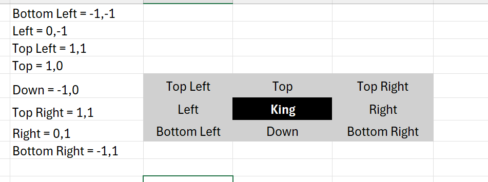

# Chess Game

## Project Setup and Commands

### Running the Application

To run the application using Maven:

1. Clean and compile the project:
   ```
   mvn clean compile
   ```

2. Run the Chess game:
   ```
   mvn exec:java "-Dexec.mainClass=chess.ChessGame"
   ```

### Running Tests

To run tests using Maven:

1. Clean and run all tests:
   ```
   mvn clean test
   ```

2. Run tests for specific classes:
    - Test for King:
      ```
      mvn test -Dtest=KingTest
      ```
    - Test for Queen:
      ```
      mvn test -Dtest=QueenTest
      ```
    - Test for Pawn:
      ```
      mvn test -Dtest=PawnTest
      ```

### Running the Application Using Java Commands

1. Compile the source files:
   ```
   javac -d out src/main/java/chess/*.java src/main/java/chess/model/*.java src/main/java/chess/pieces/*.java
   ```

2. Run the Chess game:
   ```
   java -cp out chess.ChessGame
   ```

### King Positions to move
